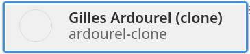
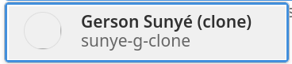
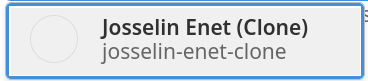
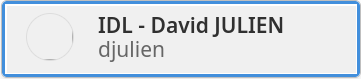
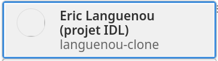
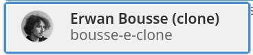

:sectnums:
:toc:


== Introduction

La fin du semestre approche, il est temps de montrer tout ce que vous avez appris et de proposer au monde entier votre première application web (webapp) !
L'objectif de ce mini-projet est d'utiliser toutes les compétences acquises lors des TP et TD précédents, afin de réaliser une application de jeu d'échecs à peu près jouable (et observable) en multijoueur réseau.

La date de rendu est fixée au 21 avril 2023 (23h55 au plus tard).


WARNING: *Ce projet est à réaliser obligatoirement par groupe de deux* (provenant du même demi-groupe de TP) ! Les groupes de trois ne sont autorisés que dans le cas d'un nombre d'étudiants impair. 


== Préparation

=== Création de votre divergence

Une seule fois par binôme, avant de commencer à travailler sur le projet, suivez rigoureusement les étapes suivantes :

. Créez une divergence (en anglais, _fork_) du projet ici-présent (
https://gitlab.univ-nantes.fr/naomod/idl/projet-2022-2023/)
. Configurez votre nouveau projet Gitlab obtenu via la divergence de la manière suivante :
.. Dans "_Paramètres → Général_", allez dans "_Visibility, project features, permissions_", et mettez "_Project visibility_" à "_Private_".
Ainsi, vous devenez le seul utilisateur autorisé à accéder à votre code source.
.. Toujours dans "_Paramètres → Général_", saisissez rigoureusement la _description_ de projet suivante, différente pour chaque groupe de TP — consultez le tableau ci-après.
+
NOTE: Cette étape est très importante car elle nous permet de retrouver vos projets sur le Gitlab.
..  Dans "_Informations du projet → Membres_", donnez accès à votre projet à votre enseignant de TP, avec le statut "_Reporter_".
Pour savoir quel compte ajouter, consultez le tableau ci-après.
..  Toujours dans "_Informations du projet → Membres_", ajoutez l'autre membre de votre binôme de projet, avec le statut "_Maintainer_".


[cols="2,3,3"]
|===
|Si votre groupe de TP est… | Vous mettez comme _Description_ | Vous ajoutez ce compte enseignant comme _Membre_ de type _Reporter_

// 284I: GA
|284I
|`idl_projet_2022-2023_284I`
| 

// 284J: GS
|284J
|`idl_projet_2022-2023_284J`
| 

// 285K: JE
|285K
|`idl_projet_2022-2023_285K`
| 

// 285L: DJ
|285L
|`idl_projet_2022-2023_285L`
| 

// 286M-288R : EL
|286M-288R
|`idl_projet_2022-2023_286M-288R`
| 

// 286N: JE
|286N
|`idl_projet_2022-2023_286N`
| 

// 287O: EB
|287O
|`idl_projet_2022-2023_287O`
| 

// 287P: EL
|287P
|`idl_projet_2022-2023_287P`
| 

// 288Q: JE
|288Q
|`idl_projet_2022-2023_288Q`
| 


|===


Ensuite terminez de préparer votre répertoire de travail :

. Ouvrez le _Terminal_ et effectuez une commande `git clone` appropriée pour récupérer votre divergence sur votre poste de travail.
*Il vous est recommandé d'utiliser l'adresse SSH de votre divergence pour faire le clone, si vous avez au préalable configuré votre accès SSH link:https://gitlab.univ-nantes.fr/naomod/idl/labs/-/tree/master/tp-gitlab#user-content-optionnel-activation-du-clone-par-ssh-dans-gitlab[comme expliqué dans le TP Gitlab].*
. Utilisez la commande `cd` pour vous rendre dans le répertoire créé par votre `git clone`, et faites la commande `npm install` pour télécharger les dépendances nécessaires.

=== Analyse de la structure du projet

Regardez la structure du projet. Le projet est organisé en différents dossiers :

[source,txt]
----
├── client
│   ├── script.js
│   └── style.css
└── views
    └── index.ejs
├── src
│   ├── main
│   │   └── ts
│   │       ├── chessboard.ts
│   │       ├── main.ts
│   │       ├── movements.ts
│   │       ├── move-validation.ts
│   │       ├── piece.ts
│   │       └── position.ts
│   └── test
│       └── ts
│           ├── bishop-move-validation.spec.ts
│           ├── king-move-validation.spec.ts
│           ├── knight-move-validation.spec.ts
│           ├── movements.spec.ts
│           ├── pawn-move-validation.spec.ts
│           ├── predefined-positions.ts
│           ├── queen-move-validation.spec.ts
│           └── rook-move-validation.spec.ts
├── node_modules
├── package.json
├── tsconfig.json
├── README.adoc
----

** Le répertoire `client` contient le code Javascript qui sera exécuté sur le navigateur, ainsi que le style de la page. 
Vous ne devez pas modifier le contenu de ce dossier.
** Le répertoire `views` contient le fichier `index.ejs` qui définit la page principale de l'application web.
Vous n'avez pas besoin de le modifier.
** Le répertoire `src/main/ts` contient le code source du serveur.
*** Dans ce dossier, _vous allez modifier le fichier `move-validation.ts`._
*** *Attention:* *En aucun cas vous ne devez modifier le contenu des fichiers `chessboard.ts`, `movements.ts`, `piece.ts` et `position.ts`.*
** Le fichier `main.ts` est le programme principal de création et gestion du serveur web.  Vous ne devez pas modifier le contenu de ce fichier.
** Le répertoire `src/test/ts` contient les tests unitaires du serveur. 
_Vous allez modifier le contenu de ce dossier_.
** Le répertoire `node_modules` contient les modules Node.js téléchargés par `npm install`.
Vous ne devez pas modifier le contenu de ce dossier.
** Le fichier `package.json` est le fichier de configuration de npm, qui décrit les dépendances ainsi que les commandes exécutables.
Vous n'avez pas besoin de le modifier.
** Le fichier `tsconfig.json` est le fichier de configuration du compilateur TypeScript. 
Il est identique à celui que vous avez utilisé en TP.
Vous n'avez pas besoin de le modifier.


=== Mise à jour du projet (seulement si demandé)

Il est possible que les enseignants aient laissé quelques coquilles dans le projet, et que ces coquilles soient corrigées alors que vous aurez déjà commencé à travailler sur le code.

*Seulement si un enseignant vous le demande*, vous pourrez récupérer les corrections des coquilles à l'aide des commandes suivantes :

```sh
git remote add upstream https://gitlab.univ-nantes.fr/naomod/idl/projet-2022-2023.git # pas besoin si déjà fait une première fois sur votre machine
git pull upstream master
git push
```

* La première ligne ajoute à votre référentiel local un lien vers le dépôt originel et le nomme `upstream`.
* La deuxième ligne récupère les changements et les fusionne avec votre divergence.


== Description du fonctionnement du projet fourni

=== Exécution des tests unitaires, exécution de l'application

Le projet utilise l'outil de construction et de gestion de modules *npm*.
Deux principales commandes vous sont fournies, exécutables avec `npm` :

** Pour lancer tous les tests unitaires du projet avec Alsatian, exécutez: `npm run test`.
** Pour lancer le serveur en mode développement, exécutez: `npm run start-server`.
Puis, une fois le serveur lancé :
*** pour accéder à l'application, ouvrez l'URL suivante: http://localhost:8080,
*** pour accéder au contenu JSON de l'échiquier en cours, utilisez l'URL suivante: http://localhost:8080/status.js.


NOTE: Comme vu en TP, il ne faut pas hésiter à lancer ces deux commandes en mode _Debug_, afin de pouvoir profiter du débogueur !
Pour rappel, nécessite de passer par l'encart _NPM Scripts_ que vous pouvez afficher tout en bas à gauche de VSCode (si besoin, retournez voir les instructions fournies dans le TP sur le test).

Deux commandes optionnelles vous sont également fournies :

** Pour supprimer le code compilé, exécutez: `npm run clean`.
** Pour supprimer les dépendances téléchargées, exécutez: `npm run clean-deps`.


=== Manuel d'utilisation de l'application

Une fois votre application lancée et ouverte dans un navigateur (voir section précédente), pour déplacer les pièces sur l'échiquier, indiquez dans le formulaire en bas de page la pièce à déplacer et sa destination.
Utilisez la notation par coordonnées, qui inclut la place à partir de laquelle la pièce se déplace, ainsi que sa destination.

.Exemples de coups
|===
|Coup |Coordonnées |Description 

| 1. |E2-E4 E7-E5 |Pion blanc en E2 se déplace à E4. Pion noir en E7 se déplace à E5.
| 2. 
|G1-F3 B8-C6
|Cavalier  blanc en G1 se déplace à F3. Cavalier noir en B8 se déplace à C6.
|===

=== Fonctionnement interne de l'application (contenu avancé, optionnel)

==== Serveur web

Le programme principal du serveur (`main.ts`) est chargé de démarrer un mini-serveur web capable de recevoir les différentes requêtes provenant des navigateurs connectés à l'application :

* `GET "/"` : distribue le fichier `views/index.ejs`;
* `GET "/status.js"` : génère et distribue l'échiquier en cours au format JSON.
* `POST "/"` : reçoit et traite un coup à jouer;

Ces trois traitements correspondent aux différents appels à `app.get()` et `app.post()` du programme principal.

==== Chronologie d'une partie

. Lorsqu'un utilisateur se connecte à l'application (adresse `"/"`), le serveur distribue alors la page html principale composée d'un échiquier vierge et d'une zone de saisie permettant à l'utilisateur de remplir le coup à jouer.

. Le navigateur internet récupère immédiatement les informations de la partie en cours présentes à l'adresse `/status.js` et remplit l'échiquier à l'aide d'un script situé dans le fichier `script.js`. Ces deux scripts se trouvent dans le dossier `client`.

. Un clic sur le bouton "Envoyer" effectue une requête de type _POST_ au à l'adresse `"/"` du serveur, contenant les informations du champs de texte associé.
Le serveur traite alors la requête afin de jouer le coup demandé.

. La page internet du joueur est alors rechargée automatiquement, affichant ainsi le nouvel état de la partie.


== Travail à réaliser

=== Code à écrire

==== Validation des mouvements

La version actuelle permet le déplacement libre des pièces, sans respecter les règles des échecs.
Il est donc possible de déplacer n'importe quelle pièce sur n'importe quelle case… ce qui n'est pas correct !

L'objectif principal de votre travail est d'écrire le code nécessaire pour vérifier qu'un mouvement est bien _valide_ (du point de vue des règles des échects) avant d'être exécuté.

Dans le projet que vous avez récupéré, ce travail a été commencé, mais pour le moment *seuls les déplacements des pions sont vérifiés*.
Vous devez mettre en oeuvre la validation des déplacements des autres pièces: le Roi, la Dame, le Cavalier, le Fou et la Tour. 

NOTE: Il n'est *pas* demandé d'implémenter les mouvements spéciaux — comme le _roque_ ou la _prise en passant_ — et il n'est *pas* demandé de prendre en compte les situations où le roi est "en échec" (qui peut empêcher ou forcer un déplacement du roi).

En interne, le traitement des déplacements se fait de la façon suivante:

. Lorsqu'une requête *POST* arrive, le serveur extrait la valeur du champ envoyé et appelle la fonction `processMove()` du module `movements`.

. La fonction `processMove()` appelle une autre fonction, `parseMoveString()`, qui transforme une chaîne de caractères en un déplacement (`type Move`) entre 2 positions (`type Position`).

. La fonction `processMove()` appelle ensuite la fonction `isMovePossible()`, qui fait appel à différentes fonctions de validation spécifiques aux pièces de l'échiquier (une par type de pièce). 
Le module `move-validation` contient toutes les fonctions de validation de déplacements.

. Par exemple, lorsqu'il s'agit d'un Pion blanc, la fonction `isMovePossible()` appelle la fonction `whitePawnMove()`, qui retourne `true` si le déplacement est possible ou `false` si ce n'est pas le cas.

. Si le mouvement est possible, c'est à dire la fonction `isMovePossible()` retourne `true`, la fonction `processMove()` appelle la fonction `performMove()`, qui effectue le déplacement.

Vous devez donc parcourir le module `move-validation` et implémenter les fonctions de validation contenant un commentaire de la forme :

```ts
// #TODO: Implement this function
```

WARNING: Vous serez évalués sur le bon fonctionnement de vos fonctions de validation.

==== Tests unitaires

Pour vérifier que les fonctions du module `move-validation` fonctionnent correctement, vous devez écrire des tests unitaires, qui vont vérifier que les fonctions acceptent les mouvements possibles et n'acceptent pas les mouvements impossibles.
Les mouvements sont possibles (ou impossibles) en accord avec les https://fr.wikipedia.org/wiki/Échecs[règles des échecs].
Comme ces règles sont complexes, vous serez mené à écrire plusieurs tests unitaires pour vérifier les mouvements possibles et impossibles d'une même pièce.

Les signatures des fonctions du module `move-validation` suivent la même convention :
[source,ts]
----
function xxxMove(board: Chessboard, move: Move): boolean
----

avec `xxx` prenant le nom de la pièce concernée, donnant par exemple `kingMove`.

Le paramètre `board` contient l'échiquier de la partie en cours et `move` contient le déplacement demandé par le joueur à travers le navigateur.
Le paramètre `move` contient deux coordonnées de type `Position`, représentant le début et la fin du déplacement.
Les coordonnées indiquent *toujours* des cases à l'intérieur de l'échiquier, c'est à dire, une colonne entre `A` et `H` et une ligne entre `1` et `8`.
Donc, il n'y a pas besoin de vérifier si un déplacement conduit une pièce à l'extérieur de l'échiquier.

Les tests unitaires de la fonction `blackPawnMove()` ont déjà été implémentés, vous les trouverez dans le fichier `./src/test/ts/pawn-move-validation-spec.ts`.
*Vous devez compléter tous les squelettes de tests unitaires fournis à l'intérieur de ces fichiers !* 

WARNING: Vous serez évalués sur le bon fonctionnement de vos tests.

==== Comment procéder ?

Vous devez procéder par itérations successives, n'essayez pas d'implémenter les fonctions d'un seul trait. Observez le cycle de développement suivant :

. Implémentez une fonctionnalité simple.
. Écrivez le ou les tests unitaires qui vérifient cette fonctionnalité.
. Exécutez les tests pour vérifier que la fonctionnalité marche correctement et la non-régression.
. Recommencez avec la fonctionnalité suivante.


*Exemple: validation des mouvements d'une Tour en plusieurs étapes*


Lorsque vous allez implémenter la fonction qui valide le mouvement des Tours (`rookMove()`), vous pouvez subdiviser leurs comportements en différentes fonctionnalités : 

* Validation des mouvements horizontaux, verticaux et diagonaux, sans se préoccuper des autres pièces.
* Invalidation des mouvements (horizontaux, verticaux et diagonaux) lorsque la case finale contient une pièce de même couleur.
* Validation des mouvements (horizontaux, verticaux et diagonaux) qui se terminent sur une case contenant une pièce d'une couleur différente.
* Invalidation des mouvements (horizontaux, verticaux et diagonaux) lorsque toutes les cases intermédiaires ne sont pas vides.

_Etape 1_

Commencez par la première fonctionnalité, la validation des déplacements horizontaux:

[source,ts]
----
// Dans le fichier "move-validation.ts"
export function rookMove(board: Chessboard, move: Move): boolean {
    // If the start rank is the same as the end rank, it's a valid horizontal move
    return move.from.rank === move.to.rank; 
}
----

Écrivez ensuite le test unitaire pour cette fonctionnalité:

[source,ts]
----
// Dans le fichier "rook-move-validation.spec.ts"
let chessboard : Chessboard;

export class TestRookMoves {
    @Setup
    beforeEach(){
        chessboard = createEmptyChessboard();

        // Note: la variable "positionE4" a été créée dans le module "predefined-positions" pour simplifier le code des tests
        
        // Place a rook piece on E4 on an empty chessboard
        putPiece(chessboard, positions.E4, pieces.whiteRook);
    }

    @Test("A rook can move horizontally")
    testCanMoveHorizontally() {
        Expect(isPossible.rookMove(chessboard, { from: positions.E4, to: positions.H4 })).toBeTruthy();
        Expect(isPossible.rookMove(chessboard, { from: positions.E4, to: positions.A4 })).toBeTruthy();
    }
}
----

_Etape 2_

Nouvelle fonctionnalité à implémenter: la validation des déplacements verticaux. 
Modifiez la fonction `rookMove()`:

[source,ts]
----
// Dans le fichier "move-validation.ts"
export function rookMove(board: Chessboard, move: Move): boolean {
    
    // If the start rank is the same as the end rank, it's a valid horizontal move
    // If the start file is the same as the end file, it's a valid vertical move
    return move.from.rank === move.to.rank || move.from.file === move.to.file
}
----

Écrivez ensuite un nouveau test unitaire pour cette nouvelle fonctionnalité:

[source,ts]
----
// Dans le fichier "rook-move-validation.spec.ts"
export class TestRookMoves {
    // (...)

    @Test("A Rook can move vertically")
    testCanMoveVertically() {
        Expect(isPossible.rookMove(chessboard, { from: positions.E4, to: positions.E8 })).toBeTruthy();
        Expect(isPossible.rookMove(chessboard, { from: positions.E4, to: positions.E1 })).toBeTruthy();
    }
}
----

_Étapes suivantes_

Suivez la même démarche pour implémenter et tester les autres fonctionnalités, c'est à dire, les autres mouvements possibles des Tours.


=== Qualité du code exigée

Il est demandé que votre travail respecte tous les principes de qualité de code étudiés en cours et en TP, ce qui inclut :

- Nommage approprié de vos fonctions et variables,
- Usage de commentaire lorsque c'est nécessaire et approprié,
- Simplification du code lorsque c'est possible.

WARNING: Vous serez évalués sur la qualité du code que vous aurez produit.

=== Utilisation de Gitlab et git

Il est demandé que votre développement soit entièrement versionné à l'aide de Gitlab et git.
Vous devez enregistrer tous les changements que vous réalisez à l'aide de _commits_ et de _pushs_ sur votre référentiel distant, en choisissant à chaque fois des messages de commit appropriés.
Vous devez également utiliser git pour collaborer à plusieurs sur votre projet, en partageant le même référentiel distant auprès des deux membres du binôme.

*Conseil* : effectuez des _commits_ et des _pushs_ régulièrement ! Cela vous permet d'éviter de perdre votre travail, et de mieux collaborer en équipe.


WARNING: Vous serez évalués sur votre usage de git, que ce soit la qualité des messages de _commit_, la fréquence des commits, et l'équilibre de la répartition des _commits_ entre les membres du binôme.

=== Rendre votre travail

Pour rendre votre projet, il vous suffit de vous assurer d'avoir parfaitement bien suivi ce qui est demandé dans la partie "Préparation" au début de ce document, et d'avoir bien validé (_commit_) et publié (_push_) tous vos changements et fichiers de travail.
Nous vous encourageons à vérifier plusieurs fois que tout a bien été fait exactement comme demandé, autrement nous ne pourrons pas avoir accès à vos projets pour les corriger.

Si vous le souhaitez, vous pouvez également ajouter un fichier "`RENDU.md`" à la racine du projet, afin de décrire les spécificités de votre projet (choix techniques, parties non traitées, extensions non demandées, etc.).

Tant que tout cela est bien fait avant la date limite de rendu, alors tout est bon !

=== Derniers conseils

* Rappelez-vous que « _Une fonction sans test unitaire ne fonctionne pas_ » !

* Rappelez-vous aussi que «*N'importe qui peut écrire du code compréhensible par les ordinateurs, mais seulement les bon développeurs parviennent à écrire du code intelligible par les humains* » !

* Écrivez les tests unitaires avant ou en même temps que les fonctions. Ne les laissez pas pour la fin, les test unitaires sont très utiles pendant le développement et vous feront gagner du temps.

